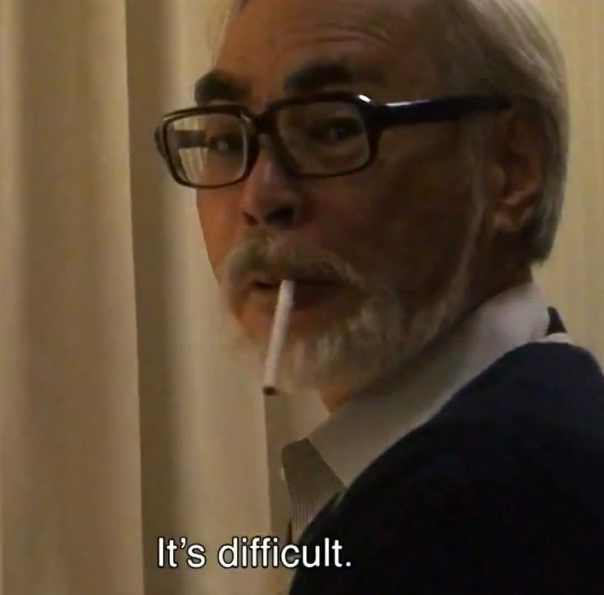

Se você que está lendo isso se preocupa com sua sanidade mental, e prefere aprender as coisas no seu tempo, saia das redes sociais o quanto antes. Essa constante necessidade de se provar, entregando constantemente valor, não vale a pena e energia despendida, principalmente para você que ainda não domina com maestria os fundamentos; o ponto aqui é: se dê o tempo, e não veja a vida alheia, economize sua atenção e se atente apenas a sua própria jornada.

Ser competente é **muito** difícil, e essa é a graça -- pelo menos pra mim (｡•̀ᴗ-)✧

